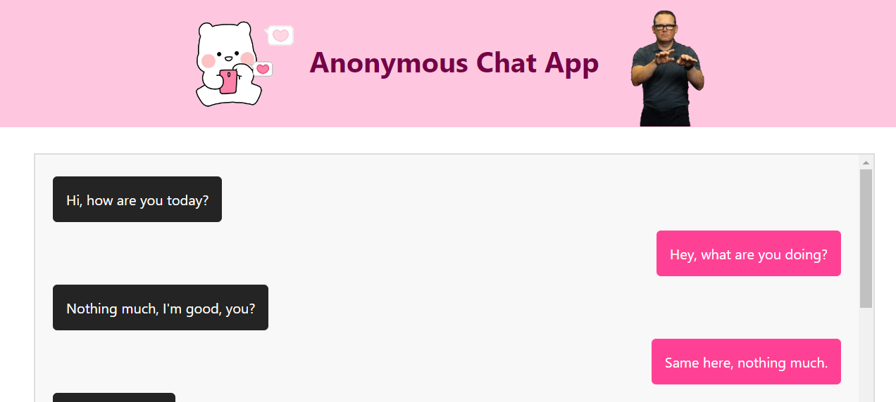

# GraphQL Redis Anonymous Chat App :love_letter::gem:

This project assignment has been prepared for the 'Kodluyoruz' GraphQL course. An anonymous chat application that includes both backend and client and works in real time with GraphQL

---

---

---

<iframe width="560" height="315" src="https://www.youtube.com/embed/i7S5gVFddrQ?si=B3AnfqVEl7A5Rtbj" title="YouTube video player" frameborder="0" allow="accelerometer; autoplay; clipboard-write; encrypted-media; gyroscope; picture-in-picture; web-share" referrerpolicy="strict-origin-when-cross-origin" allowfullscreen></iframe>
